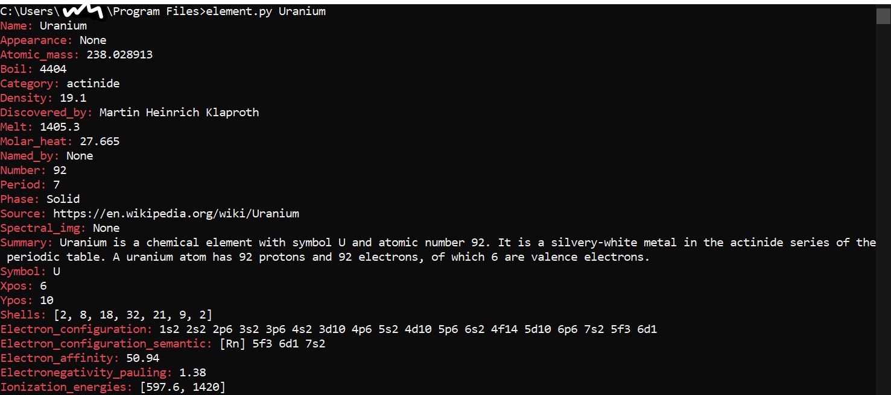

# Element-Info-Giver
This is a quick python script to give info about an element from a json file. It uses Colorama for colours.

Requirements are Colorama and the json file
https://github.com/Bowserinator/Periodic-Table-JSON/blob/master/periodic-table-lookup.json
